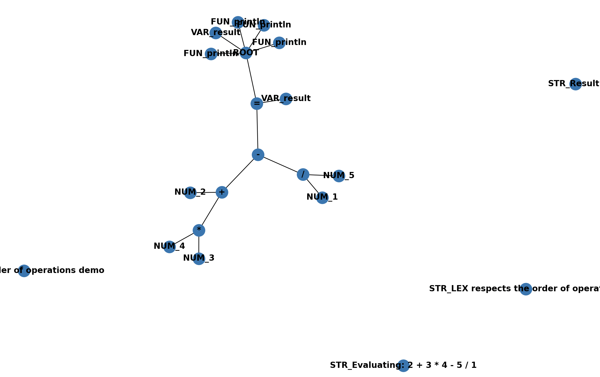

# Evidencia Final Compiladores

## Desarrollo de aplicaciones avanzadas de ciencias computacionales

- Gerardo Gutierrez Paniagua - A01029422
- Mateo Herrera Lavalle - A01751912
- Jacobo Soffer Levy - A01028653

## Indice

- [Reglas de la Gramática Implementada](#reglas-de-la-gramática-implementada)
- [Funciones](#funciones)
- [Demostración](#demostración)
  - [Operaciones numéricas básicas](#operaciones-numéricas-básicas)
  - [Manejo de imágenes con OpenCV](#manejo-de-imágenes-con-opencv)
  - [Aceptación de archivos y ejecución de su contenido](#aceptación-de-archivos-y-ejecución-de-su-contenido)
  - [Implementación de funciones](#implementación-de-funciones)
- [Conclusiones Individuales](#conclusiones-individuales)

LEX es un lenguaje con inspiración funcional. Soporta ejecutar programas desde un archivo, definir funciones y más.

## Reglas de la Gramática Implementada

    assignment      : VARIABLE SETTO expression
                    | VARIABLE CONNECT flow
                    | expression


    top_level       : top_level_expr
                    | top_level top_level_expr

    top_level_expr  : assignment newline
                    | function_definition newline
                    | expression newline

    flow            : VARIABLE CONNECT flow_functions

    flow_functions  : flow_function_call CONNECT flow_functions
                    | flow_function_call

    flow_function_call : VARIABLE DOT LPAREN params RPAREN

    expression      : expression PLUS term
                    | expression MINUS term
                    | term
                    | string

    string             : STRING

    term            : term TIMES exponent
                    | term DIVIDE exponent
                    | exponent

    exponent        : factor EXP factor
                    | factor
                    | LPAREN expression RPAREN

    factor          : NUMBER
                    | VARIABLE
                    | function_call

    function_call   : VARIABLE DOT LPAREN params RPAREN

    params          : params COMMA expression
                    | expression
                    | empty

    function_definition : VARIABLE LPAREN args RPAREN LBRACE newline statements newline RBRACE

    statements      : statement
                    | statements newline statement

    statement       : assignment

    args            : VARIABLE COMMA args
                    | VARIABLE
                    | empty

    empty           :

Nota de las reglas de gramatica: todos los programas deben terminar en newline.

## Funciones

Como herramientas adicionales o accesorios de la gramática, se utilizaron varias funciones adicionales que ayudan al manejo de imágenes por parte de OpenCV en el lexer, las cuáles se encuentran en el archivo library.py.

**`load_image`** carga una imagen utilizando la librería de OpenCV.

**`save_image`** guarda una imagen, tomando los parámetros en orden del nombre como se quiere guardar y la imagen a ser almacenada.

**`show_image`** muestra la imagen que se da como parámetro

**`search_cv2`** busca y devuelve alguna función existente en la librería de OpenCV.

**`gen_matrix`** genera una matriz utilizando los primeros dos parámetros como los datos para las dimensiones y posterior los elementos que irían dentro de la matriz.

**`gen_vector`** genera un vector usando la librería NumPy con los parámetros que se le proveen.

Adicionalmente se puede llamar cualquier función del modulo principal de NumPy de la siguiente forma `np_<nombre de la función>.()`.

También esta disponible la función `println` para imprimir a la términal.

## Demostración

Demostraciones de la implementación de procesamientos de imágenes de OpenCV junto con flujos de transformaciones en esas imágenes. Al igual que la adición de funcionalidades como la aceptación de archivos y la ejecución de su contenido junto con la implementación de funciones.

> Se pueden encontrar varios programas de ejemplo en el directorio `examples`

### Aceptación de archivos y ejecución de su contenido

Para ejecutar un programa a partir de un archivo, se debe llamar al interpretetador de la siguiente forma:

```sh
$ python lex.py <path del archivo a ejecutar> <flags>
```

Opcionalmente, se pueden pasar flags para modificar el comportamiento del interpretador:

- `draw`: Muestra el AST del programa.
- `symbols`: Imprime la tabla de símbolos al terminar la ejecución del programa.
- `treeResult`: Imprime los resultados de ejecución del árbol.

Para obtener ayuda usando el interpretador se puede correr el siguiente comando:

```sh
$ python lex.py help
```

#### Ejemplo de ejecución de un programa desde un archivo


### Asignación de variables

Para asignar variables se usa la sintaxis de `nombre = expresión`. Se pueden asignar números, strings, funciones, resultados de funciones, operaciones, entre otros.

Ejemplo:

```
println.("LEX assignment demo")

a = 1
b = 3
c = a + b
println.(c)

```

Resultado:

```
LEX assignment demo
4
```

AST:


### Operaciones numéricas básicas

LEX respeta el orden de operaciones, permitiendo realizar operaciones numéricas básicas:

```
println.("LEX order of operations demo")

println.("Evaluating: 2 + 3 * 4 - 5 / 1")

"LEX respects the order of operations"

result = 2 + 3 * 4 - 5 / 1

println.("Result:")

println.(result)

```

Resultado:

```
LEX order of operations demo
Evaluating: 2 + 3 * 4 - 5 / 1
Result:
9.0
```

AST:


### Manejo de imágenes con OpenCV

El lenguaje incluye una serie de funciones que permiten cargar y manipular imágenes a través de la librería de OpenCV. En el siguiente ejemplo se puede ver la carga de una imágen y la aplicación de un filtro:

```
println.("LEX opencv image manipulation flows and filters")

x = load_image.("test.jpg")

show_image.(x)

vec = gen_vector.(10, 10)

y = blur.(x, vec)

show_image.(y)

```

Resultado:


AST:


### Funciones

El lenguaje soporta la definición de funciones y el llamado a estas funciones, así como a funciones que son parte del lenguaje. Las funciones pueden tomar cualquier expresión como argumentos (se enforza el número de argumentos al llamarlas). Las funciones son consideradas "high order functions" lo que significa que pueden ser pasadas como argumentos a otras funciones para ser llamadas dentro de ellas. El lenguaje es capaz de recursión, aunque no existe un mecanismo para detener su ejecución (dado a que el lenguaje no ha implementado condicionales).

Las funciones corren en su propio "scope", por lo que variables creadas o modificadas dentro de la función no están disponibles fuera de esta. Las funciones tienen acceso al contexto donde fueron definidas.

Ejemplo:

```
println.("LEX function demos")

"Functions can be defined the following way"
add(a, b) {
    "The last expression in the function body is returned"
    a + b
}

"Functions can be called like so"
result = add.(18, 3)
println.("Result of add.(18, 3):")
println.(result)

"Functions in LEX are high order functions"
addTwo(n, fn) {
    two = fn.(1, 1)
    fn.(n, two)
}

println.("Result of addTwo.(11, add):")
println.(addTwo.(11, add))

```

Resultado:

```
LEX function demos
Result of add.(18, 3):
21
Result of addTwo.(11, add):
13
```

AST:


### Funciones de NumPy

Se puede llamar cualquier función del modulo `numpy`, al escribirlas cómo `np_<nombre de la función>`.

Ejemplo:

```
println.("LEX Numpy functions example")

"To use numpy functions within LEX, prepend `np_` to the function name "

a = load_image.("test.jpg")
b = np_array.(a)

mean = np_mean.(b)
println.("mean:")
println.(mean)

std = np_std.(b)
println.("std: ")
println.(std)

trace = np_trace.(b)
println.("trace:")
println.(trace)

histogram = np_histogram.(b)
println.("histogram:")
println.(histogram)

median = np_median.(b)
println.("median:")
println.(median)

flip = np_flipud.(b)
println.("flip:")
show_image.(flip)

mx = np_max.(b)
println.("max:")
println.(mx)

mn = np_min.(b)
println.("min:")
println.(mn)

floor = np_floor.(b)
println.("Floor:")
println.(floor)

```

Resultados:

```
LEX Numpy functions example
mean:
103.47957658179013
std:
93.16488497052401
trace:
[53316 52870 51279]
histogram:
(array([335965,  95873,  69746,  54211,  48699,  43430,  40983,  47965,
        91726, 166730]), array([  0. ,  25.5,  51. ,  76.5, 102. , 127.5, 153. , 178.5, 204. ,
       229.5, 255. ]))
median:
75.0
flip:
max:
255
min:
0
Floor:
[[[252. 243. 233.]
  [252. 243. 233.]
  [252. 243. 233.]
  ...
  [  1.   2.   0.]
  [  1.   2.   0.]
  [  1.   2.   0.]]

 [[253. 244. 234.]
  [253. 244. 234.]
  [253. 244. 234.]
  ...
```

Resultado de `show_image.(flip):


AST:


### Cambios en la construcción del AST y programas de múltiples líneas

El interprete soporta ejecutar programas de multiples líneas, usando newlines para separar las lineas/expresiones. El AST se construye para todo el programa (no para cada linea). Para esto se construye el AST en el parser directamente.

## Conclusiones Individuales

Enlaces a los videos individuales:

 - [](https://www.youtube.com/watch?v=1mLkspkZ5UevL_AIoTtATdBphluvQkwk6)
 
- Mateo Herrera Lavalle 

- [](https://drive.google.com/file/d/13PtwzwmoPc5dXgGZ2kQZh34oxQNFQgVJ/view?usp=drive_link)
